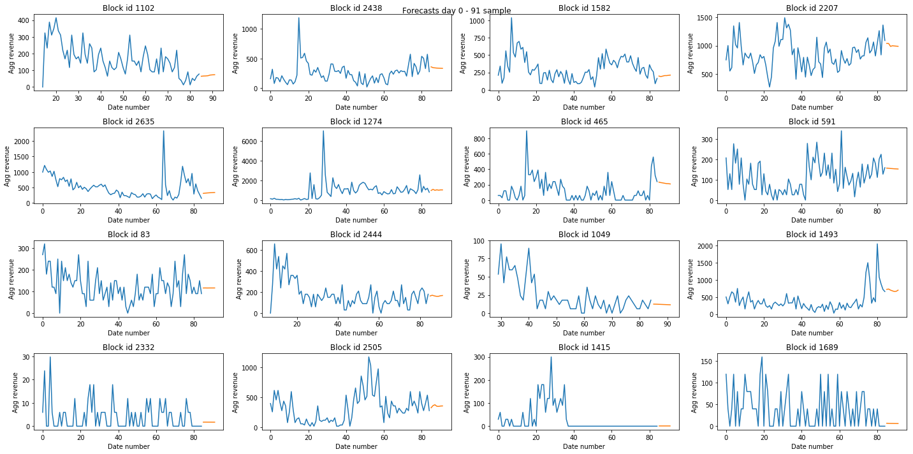

<h1 align="center">
  

  zara-data-challenge-19
</h1>

<h4 align="center">
Can you forecast fashion sales over three weeks?
</h4>

  <a href="#methodology-overview">Methodology overview</a> •
  <a href="#files-included">Files included</a> •
  <a href="#possible-improvements">Possible improvements</a> •
  <a href="#credits">Credits</a> •
  <a href="#license">License</a>

## Methodology overview

This approach does not make use of intelligent data analysis and feature extraction. Instead, it aggregates the sales of all colours
and sizes and fits a powerful forecasting model to predict the revenue. Nevertheless, this simple method was able to reach rank 31/138. The method is as follows :

1. Load `stock_and_sales_day_0_day_<n>.csv`, `products.csv` and `product_blocks.csv`. Create a denormalised table by adding the sales of all colours and sizes per product per day, and appending the block identifier. Compute the revenue as `sales x price`.

    |   | date_number | product_id | block_id | sales | price | revenue |
    |---|-------------|------------|----------|-------|-------|---------|
    | 0 | 0           | 310130     | 1726     | 11    | 12.95 | 142.45  |
    | 1 | 0           | 1178388    | 592      | 0     | 49.95 | 0.00    |
    | 2 | 0           | 1561460    | 1625     | 7     | 29.95 | 209.65  |
    | 3 | 0           | 1874414    | 1135     | 4     | 25.95 | 103.80  |

2. Pivot the previous table to get a new table with shape `(nb_products, nb_days)`, or aggregate by `date_number` and `block_id` to obtain a table with shape `(nb_blocks, nb_days)`.

    | product_id |   X0   |   X1   |   X2  |   X3   |     |   X81  |   X82  |   X83  |   X84  |
    |:----------:|:------:|:------:|:-----:|:------:|:---:|:------:|:------:|:------:|:------:|
    | 151926     | NaN    | NaN    | NaN   | NaN    | ... | 129.75 | 103.80 | 51.90  | 51.90  |
    | 213413     | NaN    | NaN    | NaN   | 59.85  | ... | 139.65 | 239.40 | 279.30 | 159.60 |
    | 310130     | 142.45 | 168.35 | 181.3 | 194.25 | ... | 25.90  | 77.70  | 77.70  | 64.75  |
    | 455200     | NaN    | NaN    | NaN   | NaN    | ... | 0.00   | 0.00   | 0.00   | 0.00   |

    | block_id |   X0   |    X1   |   X2   |    X3   |     |   X81   |   X82   |   X83   |   X84  |
    |:--------:|:------:|:-------:|:------:|:-------:|:---:|:-------:|:-------:|:-------:|:------:|
    | 0        | 674.60 | 656.90  | 403.20 | 950.40  | ... | 1827.65 | 709.05  | 389.45  | 888.85 |
    | 1        | 29.95  | 149.75  | 89.85  | 179.70  | ... | 1314.75 | 1316.60 | 1105.35 | 940.45 |
    | 2        | 679.40 | 1228.90 | 789.25 | 1138.95 | ... | 719.25  | 549.45  | 359.65  | 849.15 |
    | 3        | 53.91  | 5.99    | 41.93  | 83.86   | ... | 0.00    | 0.00    | 39.95   | 0.00   |

3. Apply the method proposed by [Montero-Manso et al. (2018)](https://github.com/M4Competition/M4-methods/tree/master/245%20-%20pmontman) in their submission for the M4 competition. This approach combines different statistical forecasting methods. The weights of the combinations are calculated per series using a learning model based on [gradient tree boosting](https://xgboost.readthedocs.io/en/latest/tutorials/model.html) exploiting features extracted from the time series as input. Extend the tables in step 2 with the predictions of the model.

    | block_id |     |   X84   |   Y85  |   Y86  |   Y87  |   Y88  |   Y89  |   Y90  |   Y91  |
    |:--------:|:---:|:-------:|:------:|:------:|:------:|:------:|:------:|:------:|:------:|
    | 0        | ... | 888.850 | 885.58 | 866.28 | 858.38 | 854.33 | 851.82 | 850.09 | 848.85 |
    | 1        | ... | 940.450 | 919.58 | 891.67 | 867.34 | 846.10 | 827.53 | 811.28 | 797.04 |
    | 2        | ... | 849.150 | 681.57 | 679.75 | 683.60 | 680.29 | 679.35 | 680.66 | 678.77 |
    | 3        | ... | 0.001   | 9.86   | 9.75   | 9.64   | 9.53   | 9.42   | 9.31   | 9.20   |

    

4. For each `block_id` (or `product_id`) in the previous table, add the resulting forecasts to get an estimation of the total revenue for the last week. Make a bet following a particular heuristic, for example, by ranking the blocks according to their predicted revenue and picking from the top of the ranking until the chosen blocks contain 50 products (greedy, not a very good heuristic tho). A better heuristic would take into account the number of products in each block, giving preference to blocks with less number of items.

## Files included

* `generate_ts_datasets.ipynb` preprocesses the original data to generate a time series dataset of `(nb_blocks, nb_days)`. Each time series represents the revenue over time of a particular block (steps 1 and 2). It can be easily modified to generate the same dataset but for products.

* `generate_forecasts.R` applies the proposed forecasting model to generate predictions for the following week (step 3).

* `generate_bets.ipynb` uses the previous forecasts to pick a bet (step 4).

* `data/preprocessed` the output of step 2 for each day of the competition.

* `data/model` the output of step 3 for each day of the competition. Also the xgboost model trained for the last day.

I have not included the original data. If you want to reproduce my results you must place this data (i.e., the _.csv_ files) in `data/raw`.

## Possible improvements

* Compute additional features from the time series by using the information in the `positions_day_0_day_<n>.csv` file (e.g., the best position of a product across all colours
and sizes for each day).

* Improve the heuristic used in `generate_bets.ipynb`. 

## Credits

I do not own the code used to generate the forecasts. As I mentioned, I used the method proposed by [Montero-Manso et al. (2018)](https://github.com/M4Competition/M4-methods/tree/master/245%20-%20pmontman) for the M4 competition. You can find the original code at [robjhyndman/M4metalearning](https://github.com/robjhyndman/M4metalearning). I adapted the code for the dataset provided by ZARA.

## License

This project is licensed under the MIT License - see the [LICENSE.md](LICENSE.md) file for details.